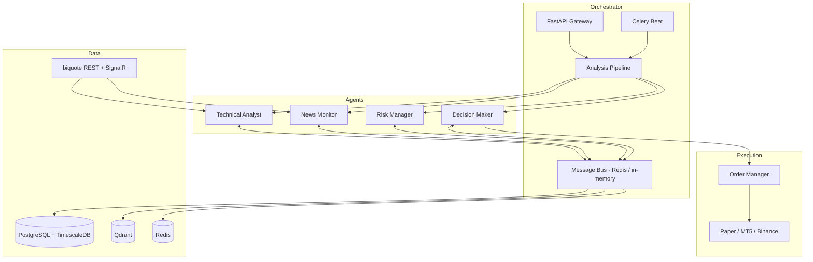

# Pkay TDAI

A multi-agent AI system that analyses **Gold (XAUUSD)** and **Bitcoin (BTCUSD)**
in real time using technical analysis, news sentiment, risk management and
weighted decision-making.


Market data is provided by [**biquote**](https://biquote.io/docs) — a free,
key-less REST + SignalR feed for FX, metals, crypto and index CFDs.

---

## Overview

Four specialised agents collaborate, and the Risk Manager holds **veto power**:

| Agent | Role | Output |
|-------|------|--------|
| **Technical Analyst** | Price action, indicators, optional ML ensemble | `TechnicalSignal` |
| **News Monitor** | Economic calendar, news, LLM sentiment | `NewsSignal` |
| **Risk Manager** | VaR, Kelly sizing, drawdown, correlation | `RiskAssessment` (veto) |
| **Decision Maker** | Weighted vote + execution | `TradeDecision` |

```
Final Score = Technical x 0.45 + News x 0.25 + Risk x 0.30
```

A risk veto always forces `SKIP` regardless of the score.

---

## Architecture



---

## Installation

### Local (no Docker required for the core)

```bash
python -m venv .venv
source .venv/bin/activate        # Windows: .venv\Scripts\activate
pip install -e ".[dev]"          # add ",ml,llm,vector" for optional extras
cp .env.example .env             # optional: sensible defaults are built in
```

The system runs end-to-end with **no external services**: the message bus falls
back to in-process pub/sub, execution defaults to the paper broker, and no API
key is needed for biquote.

### Full stack

```bash
docker compose up -d postgres redis qdrant
docker compose run --rm migrate
docker compose up api worker beat
```

| Service | Port | Purpose |
|---------|------|---------|
| `api` | 8000 | FastAPI gateway |
| `frontend` | 3000 | Next.js dashboard |
| `worker` / `beat` | — | Celery workers + scheduler |
| `postgres` | 5432 | TimescaleDB |
| `redis` | 6379 | Message bus + cache |
| `qdrant` | 6333 | Vector DB |
| `prometheus` / `grafana` | 9090 / 3001 | Monitoring |

### Frontend

```bash
cd frontend
npm install
npm run dev        # http://localhost:3000
```

The dashboard connects to the FastAPI gateway at `NEXT_PUBLIC_API_BASE_URL`
(default `http://localhost:8000`) and streams live prices over the
`/ws/ticks` WebSocket. Pages: Dashboard, Charts & Analysis, Signals Feed,
Agents, News & Events, Risk Analysis, Performance, Alerts and Settings.

---

## Usage

### API

```bash
curl http://localhost:8000/health
curl http://localhost:8000/api/v1/tick/XAUUSD
curl -X POST http://localhost:8000/api/v1/analyze/XAUUSD
curl -X POST http://localhost:8000/api/v1/analyze \
  -H "Content-Type: application/json" \
  -d '{"symbols": ["XAUUSD", "BTCUSD"]}'
```

### Python

```python
from orchestrator.main import run_analysis_cycle
from shared.schemas.enums import Timeframe

result = await run_analysis_cycle("XAUUSD", [Timeframe.M5, Timeframe.H1, Timeframe.H4])
print(result.decision.decision, result.decision.final_score)
```

### Real-time ticks

```python
from data_pipeline.biquote_feed import BiquoteTickFeed

feed = BiquoteTickFeed(["XAUUSD", "BTCUSD"])
await feed.start()
async for tick in feed.stream():
    print(tick.symbol, tick.mid, tick.market_state)
```

---

## Data source notes (biquote)

The client encodes biquote's documented gotchas so the rest of the system does
not have to:

- `last` and `volume` are always `0` — `mid` is the price.
- Markets close; a closed market returns the last price with
  `marketState == "closed"`, not an error. `Tick.is_tradeable` reflects this.
- OHLC bars arrive newest-first and may include the open bar; the client returns
  them oldest-first and exposes `closed_bars`.
- Calendar values are `None` when unpublished — never treated as `0`.
- Requests are batched (`/api/latest`) and rate-limited to 15,000/min.

---

## Development

```bash
pytest                       # unit tests
pytest --cov                 # with coverage
ruff check .                 # lint
ruff format .                # format
mypy                         # type-check (strict)
```

Standards: PEP 8, full type hints, docstrings on public functions, Conventional
Commits, minimum 80% test coverage.

---

## License

MIT — see [LICENSE](LICENSE).

## Disclaimer

Trading financial instruments carries significant risk. This software is for
educational and research purposes. biquote prices are indicative OTC broker
quotes, not exchange-licensed data. Always paper-trade before deploying capital.
