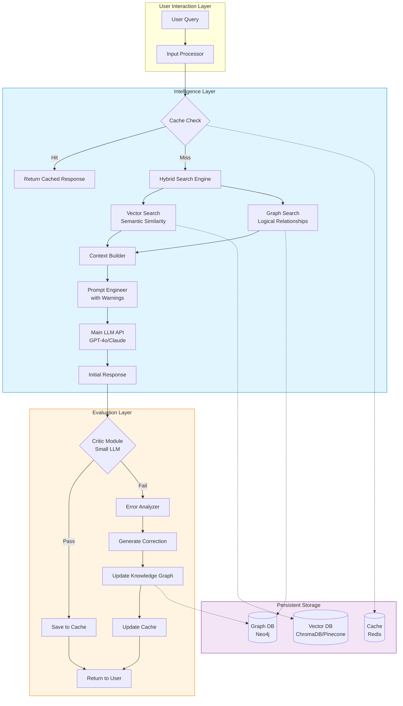
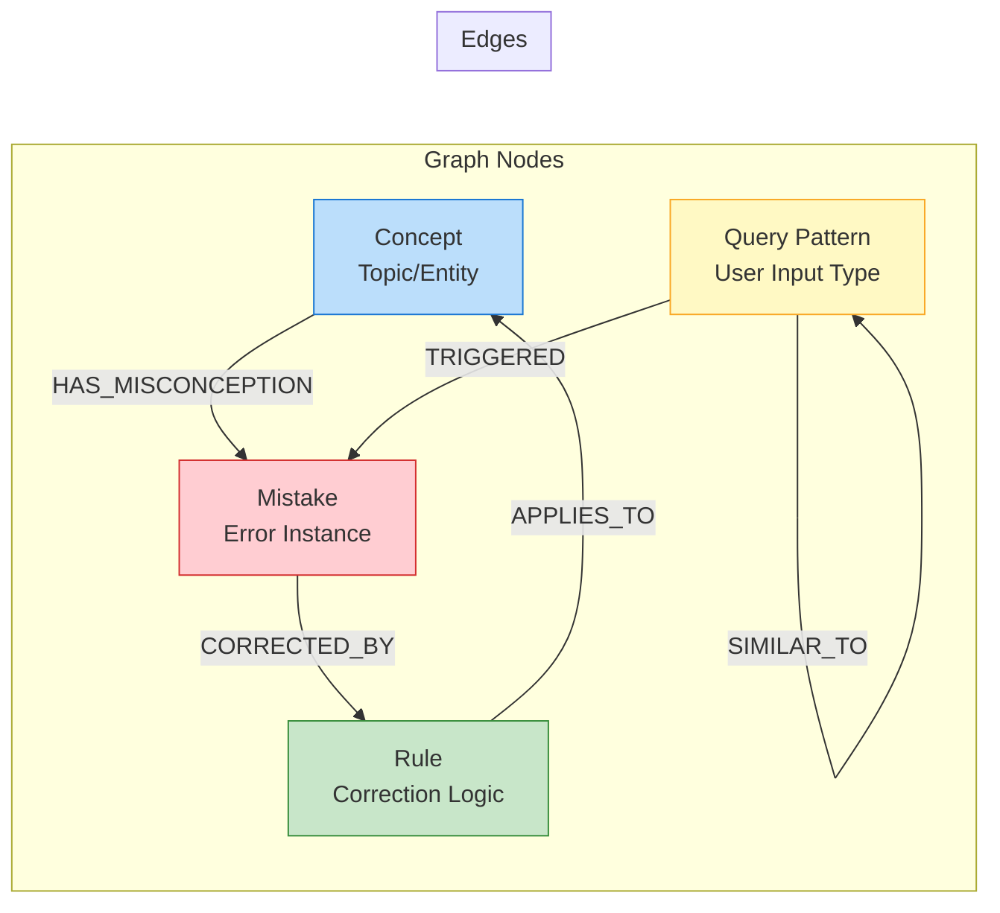
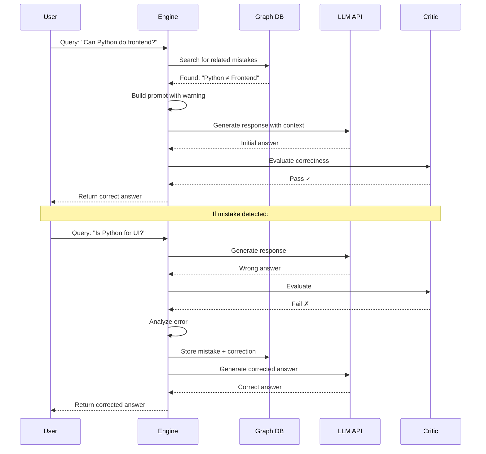
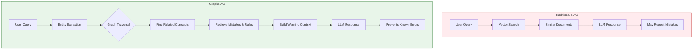
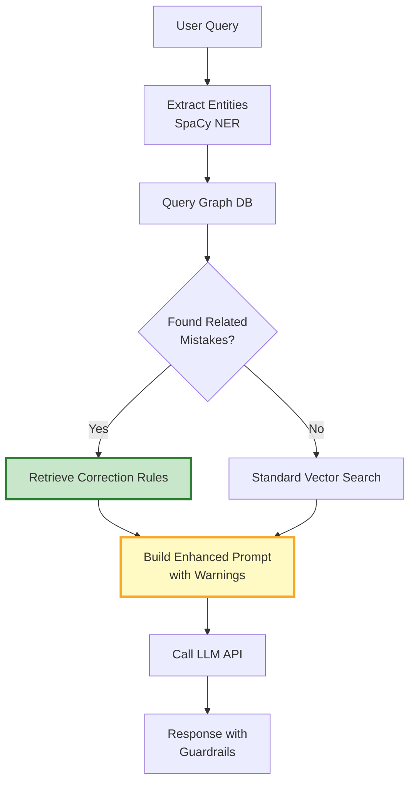
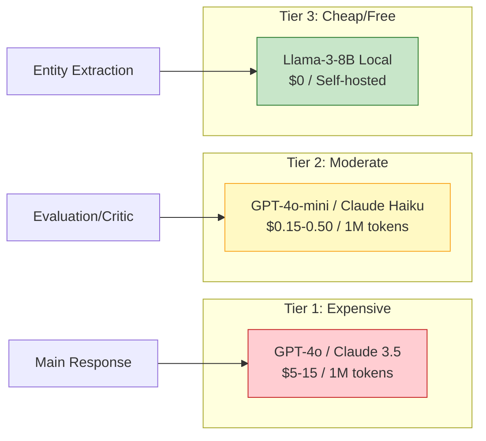
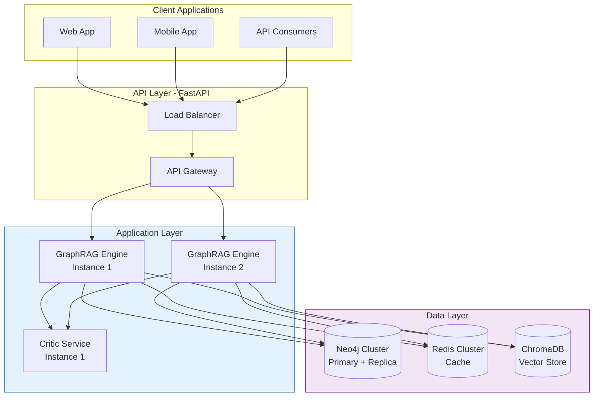
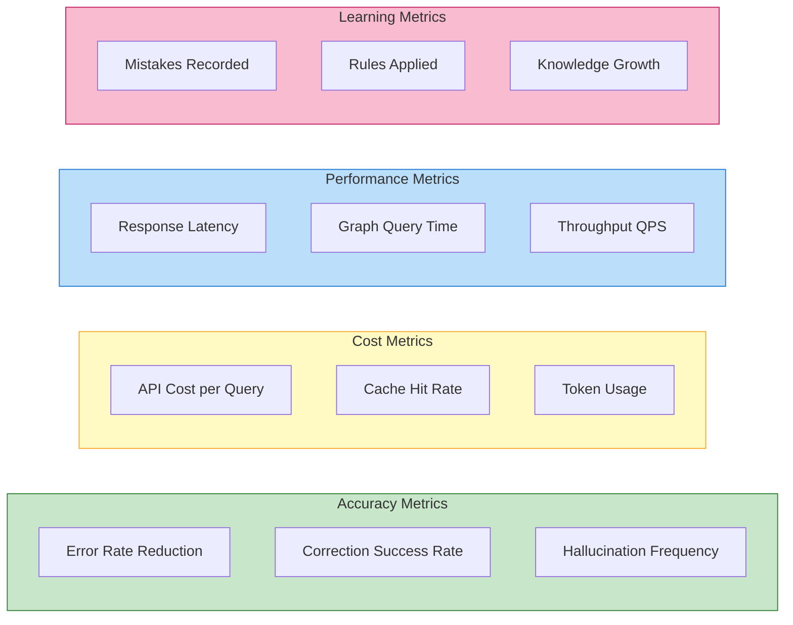
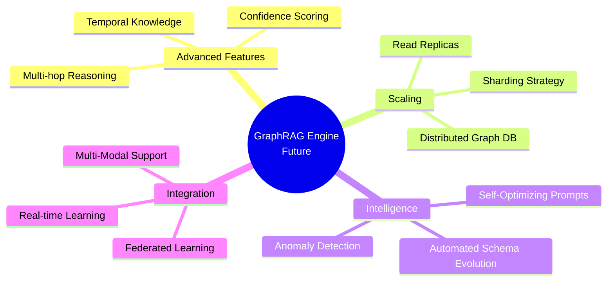

# RESEARCH.md: AI Self-Improvement Engine with GraphRAG

## Executive Summary

This document outlines the architecture and implementation strategy for building an **AI Engine that learns from its mistakes** using **GraphRAG (Graph-based Retrieval-Augmented Generation)** combined with **Python** and **AI APIs**. The system enables continuous self-improvement without requiring expensive model fine-tuning.

---

## 1. Problem Statement

Traditional AI models deployed via API cannot:
- Learn from their mistakes in real-time
- Remember past errors and corrections
- Improve their responses based on user feedback

**Goal:** Create a system where AI can:
1. Detect its own mistakes
2. Store corrections as structured knowledge
3. Retrieve and apply lessons learned to future queries
4. Optimize costs while maintaining high accuracy

---

## 2. System Architecture Overview



---

## 3. Core Components

### 3.1 Knowledge Graph Schema



### 3.2 Data Flow for Learning



---

## 4. Technical Stack

| Component | Technology | Purpose |
|-----------|-----------|---------|
| **Language** | Python 3.10+ | Core implementation |
| **AI Framework** | LangChain / LlamaIndex | RAG orchestration |
| **Graph Database** | Neo4j | Store relationships & rules |
| **Vector Database** | ChromaDB / Pinecone | Semantic search |
| **Cache** | Redis | Reduce API calls |
| **LLM API** | OpenAI GPT-4o / Claude | Main reasoning |
| **Critic Model** | GPT-4o-mini / Llama-3-8B | Cost-effective evaluation |
| **NER** | SpaCy | Entity extraction |
| **API Framework** | FastAPI | REST API deployment |
| **Data Validation** | Pydantic | Type safety |

---

## 5. GraphRAG Deep Dive

### 5.1 Why GraphRAG over Traditional RAG?



### 5.2 Knowledge Graph Example

**Scenario:** AI incorrectly states that "Paris is the capital of Germany"

```cypher
// Create Concepts
CREATE (p:Concept {name: "Paris", type: "City"})
CREATE (g:Concept {name: "Germany", type: "Country"})
CREATE (f:Concept {name: "France", type: "Country"})

// Record the Mistake
CREATE (m:Mistake {
    id: "err_geo_001",
    description: "Claimed Paris is capital of Germany",
    severity: "high",
    timestamp: datetime()
})

// Create Correction Rule
CREATE (r:Rule {
    id: "rule_geo_001",
    text: "Paris is the capital of France, not Germany. Berlin is the capital of Germany.",
    confidence: 1.0
})

// Establish Relationships
CREATE (p)-[:MISCONCEPTION_LINKED_TO]->(g)
CREATE (g)-[:HAS_MISTAKE_INSTANCE]->(m)
CREATE (m)-[:CORRECTED_BY]->(r)
CREATE (r)-::APPLIES_TO]->(p)
CREATE (p)-[:TRUE_RELATIONSHIP {relation: "capital_of"}]->(f)
```

### 5.3 Retrieval Strategy



---

## 6. Cost Optimization Strategies

### 6.1 Multi-Tier Model Architecture



### 6.2 Cost Comparison

| Strategy | API Calls/Query | Est. Cost/1000 Queries | Savings |
|----------|----------------|------------------------|---------|
| **Naive Self-Correction** | 3 | $15.00 | Baseline |
| **Optimized with Small Critic** | 1.2 | $6.00 | 60% |
| **+ Semantic Caching** | 0.8 | $4.00 | 73% |
| **+ GraphRAG Prevention** | 0.7 | $3.50 | 77% |
---

### 6.3 Core Implementation

```python
# src/core/graph_rag.py

from neo4j import GraphDatabase
from langchain_openai import ChatOpenAI
from langchain_core.prompts import ChatPromptTemplate
from pydantic import BaseModel
import spacy
from typing import List, Optional
import redis
import json

class Mistake(BaseModel):
    concept: str
    description: str
    rule: str
    severity: str = "medium"

class GraphRAGEngine:
    def __init__(self, config):
        # Neo4j Connection
        self.driver = GraphDatabase.driver(
            config.neo4j_uri,
            auth=(config.neo4j_user, config.neo4j_password)
        )
        
        # LLM Setup
        self.main_llm = ChatOpenAI(
            model="gpt-4o",
            temperature=0
        )
        self.critic_llm = ChatOpenAI(
            model="gpt-4o-mini",
            temperature=0
        )
        
        # NER
        self.nlp = spacy.load("en_core_web_sm")
        
        # Cache
        self.cache = redis.Redis(
            host=config.redis_host,
            port=config.redis_port,
            decode_responses=True
        )
    
    def record_mistake(self, mistake: Mistake):
        """Store a mistake and its correction in the graph"""
        query = """
        MERGE (c:Concept {name: $concept})
        MERGE (m:Mistake {description: $description})
        MERGE (r:Rule {text: $rule})
        MERGE (c)-[:HAS_MISCONCEPTION]->(m)
        MERGE (m)-[:CORRECTED_BY]->(r)
        """
        with self.driver.session() as session:
            session.run(
                query,
                concept=mistake.concept,
                description=mistake.description,
                rule=mistake.rule
            )
    
    def get_related_mistakes(self, query: str) -> List[dict]:
        """Retrieve related mistakes from graph"""
        doc = self.nlp(query)
        entities = [ent.text for ent in doc.ents]
        
        if not entities:
            return []
        
        cypher = """
        MATCH (c:Concept)-[:HAS_MISCONCEPTION]->(m:Mistake)-[:CORRECTED_BY]->(r:Rule)
        WHERE c.name IN $entities
        RETURN m.description as mistake, r.text as rule
        LIMIT 5
        """
        
        with self.driver.session() as session:
            results = session.run(cypher, entities=entities)
            return [record.data() for record in results]
    
    def build_enhanced_prompt(self, query: str, mistakes: List[dict]) -> str:
        """Build prompt with warnings from past mistakes"""
        warnings = ""
        if mistakes:
            warnings = "\n".join([
                f"⚠️ WARNING: Avoid this mistake: '{m['mistake']}'. "
                f"Correct approach: '{m['rule']}'"
                for m in mistakes
            ])
        
        return f"""You are a helpful assistant. Answer accurately.

{warnings if warnings else "No specific warnings."}

Question: {query}
Answer:"""
    
    def evaluate_response(self, query: str, response: str) -> dict:
        """Use small LLM to evaluate response"""
        eval_prompt = f"""Evaluate if this answer is correct.
Question: {query}
Answer: {response}

Return JSON: {{"is_correct": boolean, "reason": string}}"""
        
        result = self.critic_llm.invoke(eval_prompt)
        return json.loads(result.content)
    
    def answer(self, query: str) -> str:
        """Main entry point"""
        # Check cache
        cached = self.cache.get(query)
        if cached:
            return cached
        
        # Retrieve related mistakes
        mistakes = self.get_related_mistakes(query)
        
        # Build prompt
        prompt = self.build_enhanced_prompt(query, mistakes)
        
        # Generate response
        response = self.main_llm.invoke(prompt).content
        
        # Evaluate
        evaluation = self.evaluate_response(query, response)
        
        if not evaluation["is_correct"]:
            # Generate corrected response
            correction_prompt = f"""Your previous answer was wrong: {evaluation['reason']}
Please provide the correct answer.
Question: {query}"""
            response = self.main_llm.invoke(correction_prompt).content
            
            # Record the mistake
            self.record_mistake(Mistake(
                concept=query.split()[0] if query.split() else "unknown",
                description=f"Initial wrong answer to: {query}",
                rule=evaluation["reason"]
            ))
        
        # Cache result
        self.cache.setex(query, 3600, response)
        
        return response
```

---

## 6.4 Deployment Architecture



---

## 6.5 Performance Metrics

### 6.6 Key Metrics to Track



---

## 11. Challenges & Mitigations

| Challenge | Impact | Mitigation Strategy |
|-----------|--------|---------------------|
| **Graph Schema Complexity** | High development time | Start simple, iterate. Use predefined templates. |
| **Entity Extraction Accuracy** | Missed mistakes | Use LLM-based extraction as fallback |
| **Cost Overrun** | Budget exceeded | Implement strict caching and tiered models |
| **Latency Increase** | Poor UX | Async processing, optimize Cypher queries |
| **Knowledge Graph Bloat** | Slow queries | Implement TTL, archive old mistakes |
| **Critic Reliability** | False corrections | Use ensemble of critics, human review for critical cases |

---

## 6.7 Future Enhancements



---

## 6.8 References & Resources

### Documentation
- [Neo4j Python Driver](https://neo4j.com/docs/python-manual/current/)
- [LangChain GraphRAG](https://python.langchain.com/docs/modules/data_connection/graph/)
- [OpenAI API](https://platform.openai.com/docs)

### Papers
- "GraphRAG: Unlocking LLM Discovery on Narrative Private Data" - Microsoft Research
- "Retrieval-Augmented Generation for Knowledge-Intensive NLP Tasks"

### Tools
- Neo4j Desktop: https://neo4j.com/download/
- LangChain: https://github.com/langchain-ai/langchain
- SpaCy: https://spacy.io/

---

*Document Version: 1.0*  
*Last Updated: 2026-09-22*  
*Author: Mengleap*