---

```markdown
# Pkay TDAI — Enhanced Multi-Agent AI Trading System

> A production-grade, self-adaptive multi-agent system for analyzing Gold (XAUUSD) and Bitcoin (BTCUSD) markets with metacognitive awareness, causal reasoning, and institutional-level risk control.


---

## Table of Contents

- [Overview](#overview)
- [Original Problem Statement](#original-problem-statement)
- [Solution Roadmap — Problems 1 to 14](#solution-roadmap--problems-1-to-14)
- [Frontier Enhancements — Levels 1 to 12](#frontier-enhancements--levels-1-to-12)
- [Enhanced Architecture](#enhanced-architecture)
- [Agent Lifecycle](#agent-lifecycle)
- [Implementation Phases](#implementation-phases)
- [Success Metrics](#success-metrics)
- [Disclaimer](#disclaimer)

---

## Overview

Pkay TDAI is a **multi-agent AI trading system** that combines technical analysis, news sentiment, on-chain metrics, macro correlation, and risk management to produce high-quality trading signals for **XAUUSD** and **BTCUSD**.

This document summarizes the **complete enhancement plan** derived from iterative design review — covering:

1. **14 concrete solutions** to fix agent reliability and weak signal problems
2. **12 frontier-level architectural enhancements** for institutional-grade autonomy

The guiding principle: **A great trading system is not one that wins every trade, but one that knows when to stop and learns from its mistakes.**

---

## Original Problem Statement

| Symptom | Root Cause |
|---------|-----------|
| Agents underperform | Missing verification layer between agents |
| Weak signals | Static thresholds + static weights |
| Inconsistent decisions | No cross-agent consistency check |
| No learning | Agents don't remember past outcomes |
| Fragile execution | No kill switch, no anomaly detection |

---

## Solution Roadmap — Problems 1 to 14

### Problem 1 — Agent Output Validation

**Problem:** Agents emit malformed or hallucinated output with no guard.

**Solution:** Introduce a **Pydantic-based validation layer** enforced inside `BaseAgent`. Every agent subclass implements only `_execute()`; validation, retry, and fallback are handled by the template method.

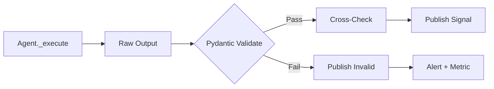

---

### Problem 2 — Circuit Breaker per Agent

**Problem:** A failing agent keeps consuming resources.

**Solution:** Wrap each agent in a **Circuit Breaker** with `CLOSED / OPEN / HALF_OPEN` states.

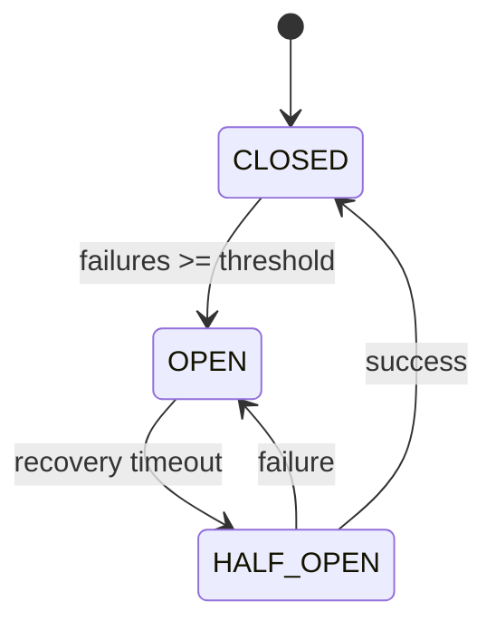

---

### Problem 3 — Cross-Agent Consistency Check

**Problem:** Agents can contradict each other (e.g., Technical=BULLISH, News=HAWKISH).

**Solution:** A **`shared/cross_checks.py`** module that inspects all signals before decision and downgrades confidence on conflict.

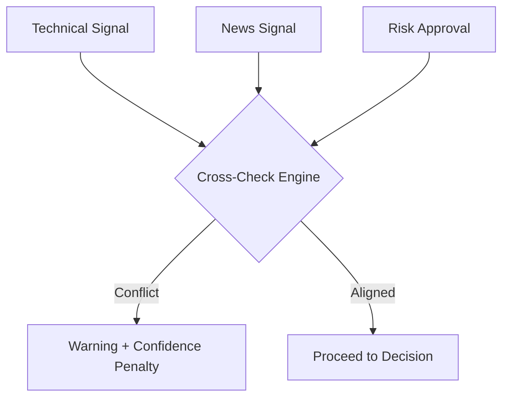

---

### Problem 4 — Regime-Aware Adaptive Weighting

**Problem:** Static weights (0.45/0.25/0.30) fail across market regimes.

**Solution:** Detect regime (Trending / Sideway / Volatile) and switch weights + thresholds dynamically.

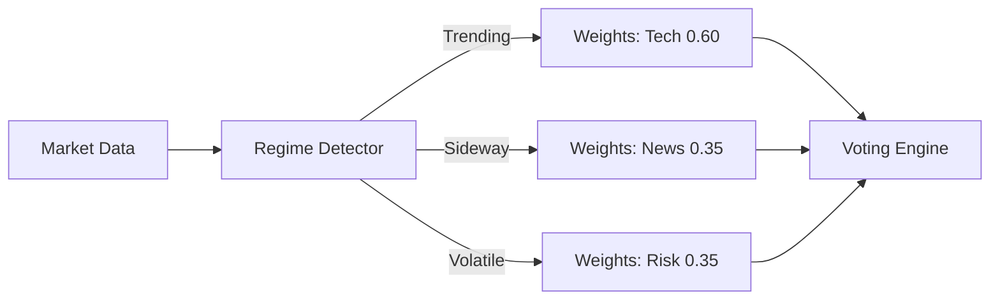

---

### Problem 5 — Non-Linear Decision Aggregation

**Problem:** Weighted sum cannot capture agent conflicts.

**Solution:** Use **Geometric Mean** with Risk as a multiplier, plus hard rules:

- If `Risk < 0.5` → **VETO**
- If `Tech > 0.85 AND News > 0.40` → allow
- If `News > 0.85 AND Tech < 0.40` → cap score at 0.50

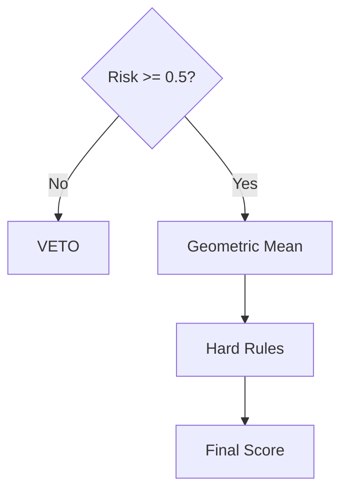

---

### Problem 6 — Multi-Timeframe Confirmation Engine

**Problem:** Technical Analyst evaluates timeframes in isolation.

**Solution:** Enforce structural roles — **H4 = bias, H1 = setup, M15 = entry, M5 = trigger**. Require ≥ 3/4 alignment to emit a strong signal.

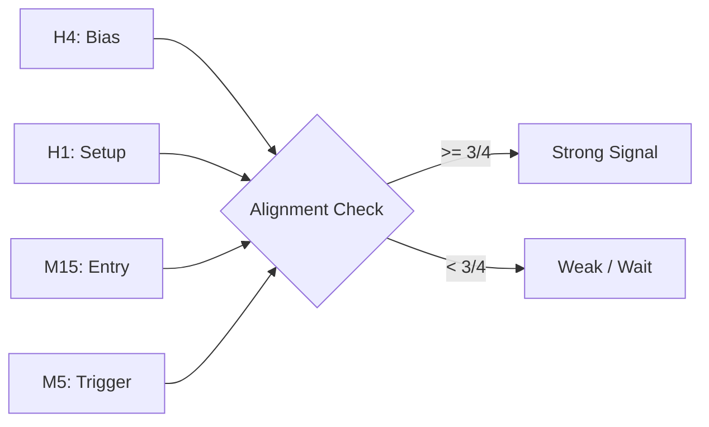

---

### Problem 7 — Order Flow Imbalance Analyzer

**Problem:** Price indicators miss institutional absorption.

**Solution:** Analyze cumulative delta, divergence, and exhaustion to detect **bullish/bearish absorption**.

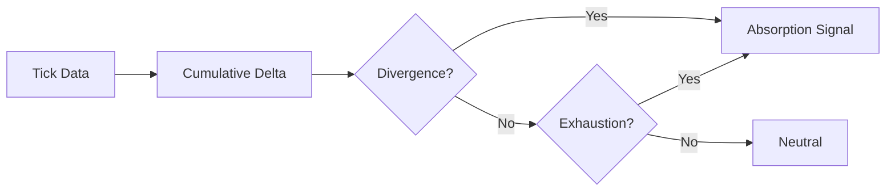

---

### Problem 8 — Episodic Memory via Qdrant

**Problem:** Agents don't remember past decisions.

**Solution:** Store every decision + outcome as a vector embedding in **Qdrant**. Before deciding, recall similar past situations and adjust score by historical win rate.

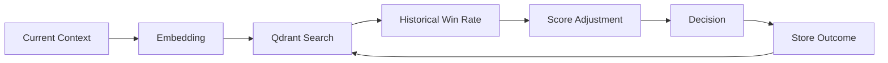

---

### Problem 9 — HMM Regime Detector

**Problem:** ADX/ATR heuristics are too crude.

**Solution:** Train a **Gaussian HMM** on returns, volatility, ATR, and volume ratio. Map hidden states to regimes: `BULL_TREND`, `BEAR_TREND`, `RANGE`, `HIGH_VOL`.

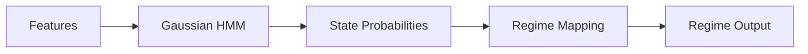

---

### Problem 10 — LLM Reasoning Layer

**Problem:** Decisions lack explainability and self-critique.

**Solution:** Pass all signals through an **LLM Reasoner** with Chain-of-Thought that outputs: `consistent`, `conflicts`, `red_flags`, `confidence_adjustment`.

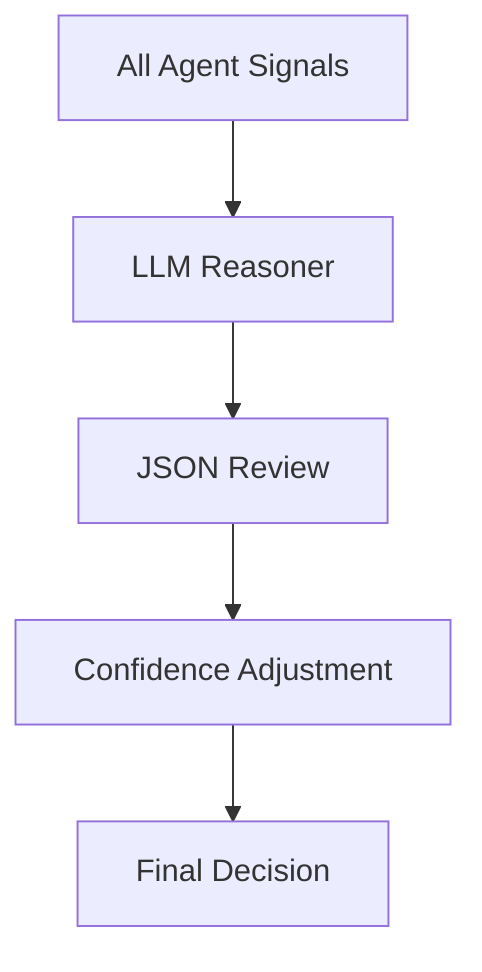

---

### Problem 11 — Portfolio-Level Risk Manager

**Problem:** Risk Manager evaluates trades individually, not as a portfolio.

**Solution:** Add **Portfolio VaR**, correlation matrix, component VaR, and multi-scenario stress testing.

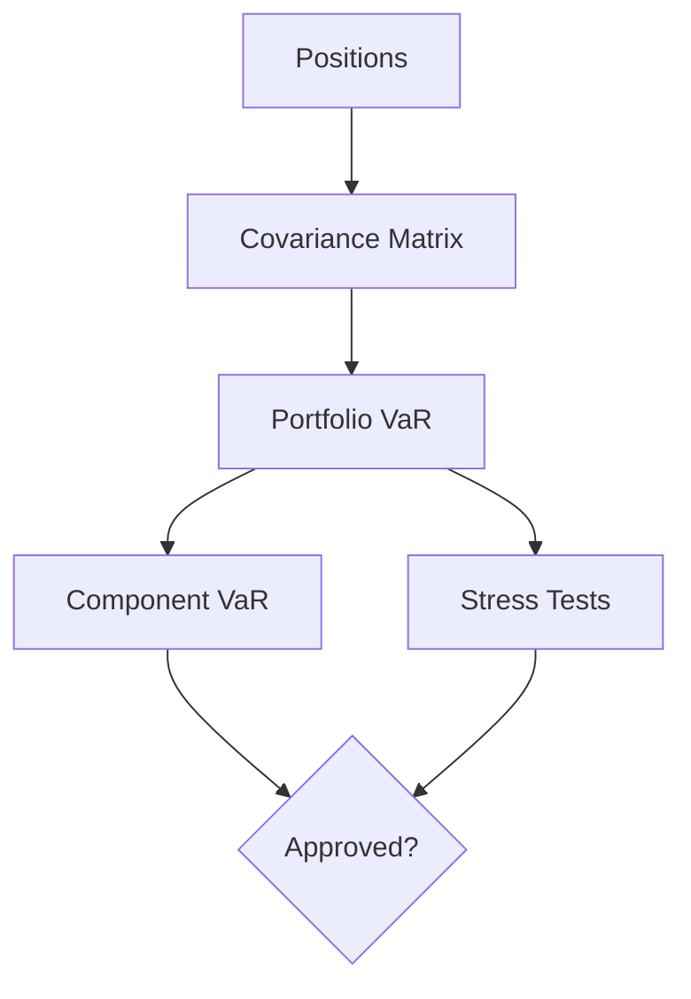

---

### Problem 12 — Dynamic Risk Limits

**Problem:** Static risk limits are too tight or too loose depending on volatility.

**Solution:** Scale limits by **ATR percentile** — tighten in high vol, loosen in low vol.

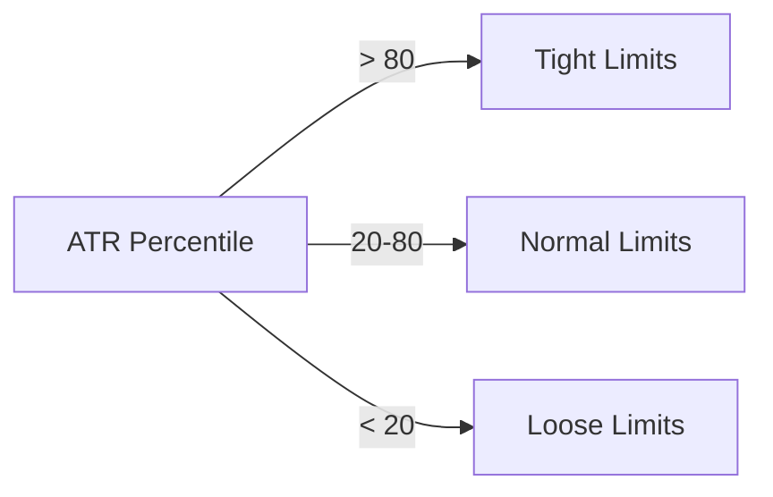

---

### Problem 13 — Backtesting & Replay Engine

**Problem:** No way to evaluate changes before deploying live.

**Solution:** Build a **Replay Engine** that replays historical data at configurable speed and produces full statistics (win rate, Sharpe, max DD, profit factor).

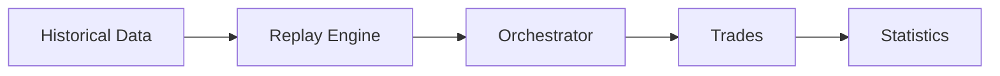

---

### Problem 14 — A/B Testing Framework

**Problem:** Cannot compare two system versions objectively.

**Solution:** Run both versions on the same data and compare by Sharpe, win rate, and max drawdown.

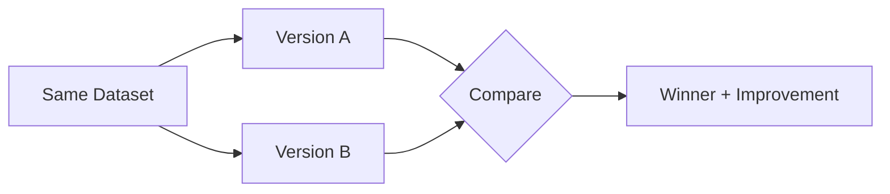

---

## Frontier Enhancements — Levels 1 to 12

### Level 1 — Meta-Cognition Layer

**Principle:** Agents must know when they don't know.

**Techniques:** Out-of-Distribution Detection, Conformal Prediction, MC Dropout, Deep Ensembles, Abstention Mechanism.

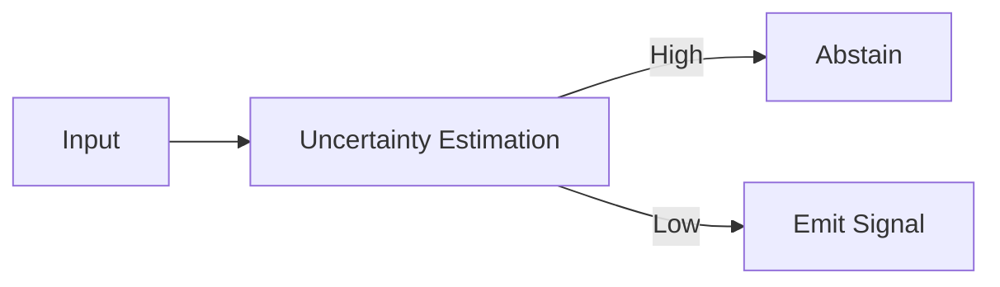

**Impact:** 40–60% reduction in false signals.

---

### Level 2 — Regime-Aware Meta-Learning

**Principle:** Learn how to learn across regimes.

**Techniques:** Mixture of Experts, MAML, Thompson Sampling, EWC for continual learning.

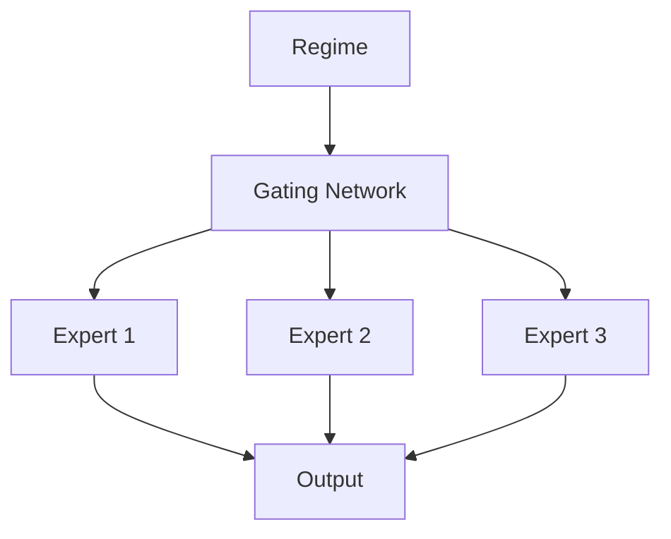

**Impact:** Faster adaptation, no catastrophic forgetting.

---

### Level 3 — Causal Inference

**Principle:** Understand "why", not just "what".

**Techniques:** Structural Causal Models, Counterfactual Reasoning, Granger Causality, Causal Discovery (PC, FCI, NOTEARS).

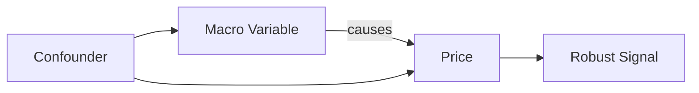

**Impact:** Robustness against spurious correlations.

---

### Level 4 — Adversarial Robustness

**Principle:** Assume the market contains adversaries.

**Techniques:** Adversarial Training, Manipulation Detection, Game-Theoretic Modeling, Red Team Agents, Byzantine Fault Tolerance.

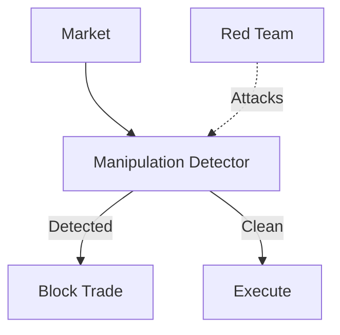

**Impact:** Resistance to spoofing, layering, stop hunting.

---

### Level 5 — Evolutionary Architecture

**Principle:** The system evolves its own strategies.

**Techniques:** Genetic Programming, NEAT, MAP-Elites, Co-evolution, Novelty Search.

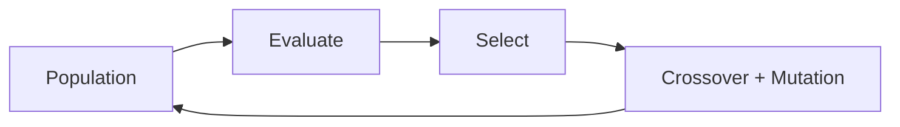

**Impact:** Discovers novel edges humans miss.

---

### Level 6 — Multi-Agent Game Theory

**Principle:** Agents should debate, not just agree.

**Techniques:** Bull vs Bear Agents, Devil's Advocate, Judge Agent, Auction Mechanism, Reputation System, Mechanism Design.

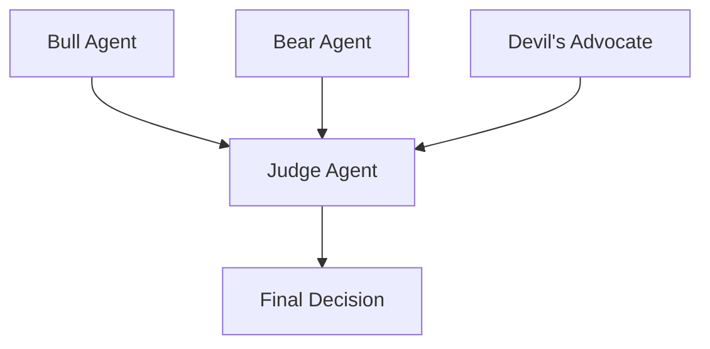

**Impact:** Higher decision quality via adversarial critique.

---

### Level 7 — World Model

**Principle:** Agents simulate before acting.

**Techniques:** Latent World Model, Rollout Planning, MCTS, Dreamer, Counterfactual Simulation.

```mermaid
flowchart LR
    S[State] --> WM[World Model]
    WM --> R[Rollouts]
    R --> P[Plan]
    P --> A[Action]
```

**Impact:** Forward-looking decisions instead of pure reactions.

---

### Level 8 — Quantum-Inspired Computing

**Principle:** Solve NP-hard optimization faster.

**Techniques:** Quantum Annealing, QAOA, VQE, Quantum RL, Tensor Networks.

```mermaid
flowchart LR
    PO[Portfolio Problem] --> QA[Quantum-Inspired Solver]
    QA --> O[Optimal Allocation]
```

**Impact:** Real-time portfolio optimization.

---

### Level 9 — Swarm Intelligence

**Principle:** Collective intelligence from many small agents.

**Techniques:** PSO, Ant Colony, Bee Algorithm, Stigmergy, Emergent Behavior.

```mermaid
flowchart TB
    A1[Agent] --> M[Shared Environment]
    A2[Agent] --> M
    A3[Agent] --> M
    M --> E[Emergent Behavior]
```

**Impact:** Robustness, no single point of failure.

---

### Level 10 — Global Workspace Theory

**Principle:** Consciousness-inspired information sharing.

**Techniques:** Attention Schema, Global Broadcast, Competition for Access, Integration, Self-Model.

```mermaid
flowchart TB
    M1[Module] --> GW[Global Workspace]
    M2[Module] --> GW
    M3[Module] --> GW
    GW --> B[Broadcast to All]
```

**Impact:** High coherence and information integration.

---

### Level 11 — Emergent Behavior & Self-Organization

**Principle:** Good behavior emerges from well-designed incentives.

**Techniques:** Reward Shaping, Curriculum Learning, Open-Ended Learning, Autotelic Agents, Self-Play.

```mermaid
flowchart LR
    E[Environment] --> A[Agent]
    A --> B[Behavior]
    B --> R[Reward]
    R --> A
```

**Impact:** Novel strategies discovered autonomously.

---

### Level 12 — AGI-Ready Architecture

**Principle:** Design for any task, not just current ones.

**Techniques:** Modular Architecture, Meta-Learning, Few-Shot Adaptation, Transfer Learning, Compositional Generalization, Instruction Following.

```mermaid
flowchart TB
    C[Core] --> M1[Module A]
    C --> M2[Module B]
    C --> M3[Module N]
    M1 --> T[New Task]
    M2 --> T
    M3 --> T
```

**Impact:** Extensible to any market or strategy.

---

## Enhanced Architecture

```mermaid
graph TB
    subgraph ORCH["Orchestrator Layer"]
        API[FastAPI Gateway]
        BUS[Priority Message Bus]
        REG[Agent Registry + Circuit Breaker]
        HEALTH[Health Monitor]
    end

    subgraph CORE["Core Intelligence"]
        META[Meta-Cognition]
        CAUSAL[Causal Inference]
        WM[World Model]
        MEM[Episodic Memory]
    end

    subgraph AGENTS["Enhanced Agents"]
        TA[Technical Analyst + MTF + OFI]
        NM[News Monitor + On-Chain + Macro]
        RM[Risk Manager + Portfolio VaR]
        DM[Decision Maker + LLM Reasoner]
        RT[Red Team Agent]
        JUDGE[Judge Agent]
    end

    subgraph SAFETY["Safety & Learning"]
        KS[Kill Switch]
        ANOM[Anomaly Detector]
        CAL[Confidence Calibrator]
        ONLINE[Online Learner]
    end

    subgraph DATA["Data Layer"]
        DB[(PostgreSQL + TimescaleDB)]
        VDB[(Qdrant)]
        CACHE[(Redis)]
    end

    API --> BUS
    BUS --> REG
    REG --> AGENTS
    AGENTS --> CORE
    CORE --> SAFETY
    SAFETY --> DATA
    AGENTS --> SAFETY
    HEALTH --> REG
```

---

## Agent Lifecycle

```mermaid
sequenceDiagram
    participant O as Orchestrator
    participant R as Registry
    participant A as Agent
    participant V as Validator
    participant C as Cross-Check
    participant M as Memory
    participant B as Bus

    O->>R: dispatch(agent, input)
    R->>A: run(input)
    A->>A: _execute()
    A->>V: validate output
    V-->>A: valid / invalid
    A->>C: cross-check
    C-->>A: warnings
    A->>M: recall similar
    M-->>A: historical WR
    A->>A: adjust confidence
    A->>B: publish signal
    B-->>O: downstream
```

---

## Implementation Phases

```mermaid
gantt
    title Enhancement Roadmap
    dateFormat YYYY-MM-DD
    section Foundation
    Validation + BaseAgent        :a1, 2026-01-01, 14d
    Cross-Check Layer             :a2, after a1, 7d
    section Intelligence
    HMM Regime Detector           :b1, after a2, 14d
    Multi-Timeframe Engine        :b2, after b1, 14d
    Order Flow Analyzer           :b3, after b2, 14d
    section Memory & Risk
    Episodic Memory               :c1, after b3, 14d
    Portfolio Risk Manager        :c2, after c1, 14d
    LLM Reasoner                  :c3, after c2, 14d
    section Testing
    Replay Engine                 :d1, after c3, 14d
    A/B Testing                   :d2, after d1, 7d
    Monte Carlo Simulator         :d3, after d2, 14d
    section Hardening
    Kill Switch + Anomaly         :e1, after d3, 14d
    Idempotency + Rate Limit      :e2, after e1, 7d
    section Frontier
    Meta-Cognition                :f1, after e2, 21d
    Causal Inference              :f2, after f1, 21d
    Adversarial Robustness        :f3, after f2, 21d
    World Model                   :f4, after f3, 30d
```

---

## Success Metrics

| Metric | Baseline | Target | Measurement |
|--------|----------|--------|-------------|
| Agent Output Validity | ~60% | > 98% | Validation pass rate |
| Signal Win Rate | ~45% | > 60% | Backtest + live |
| Sharpe Ratio | ~0.8 | > 1.8 | Rolling 90-day |
| Max Drawdown | ~15% | < 5% | Daily tracking |
| Decision Latency P95 | > 10s | < 3s | Prometheus |
| False Signal Rate | ~40% | < 15% | Cross-check + abstention |
| Calibration Error | High | < 0.05 | Brier score |

---

## Core Principles

1. **Validation is the foundation** — No signal leaves an agent without passing schema + cross-check.
2. **Consistency beats consensus** — Agents must agree on facts, not just vote.
3. **Memory enables intelligence** — Agents that remember don't repeat mistakes.
4. **Safety precedes profit** — Kill switch and anomaly detection are non-negotiable.
5. **Adaptation is continuous** — Static weights and thresholds are technical debt.
6. **Uncertainty is information** — An agent that says "I don't know" is more valuable than one that guesses.
7. **Causation beats correlation** — Understand why before trading what.

---

## Disclaimer

**Trading financial instruments carries significant risk.** This software is for educational and research purposes. Past performance does not guarantee future results. Always test strategies in paper trading before deploying capital. The authors are not responsible for any financial losses.

---

## License

MIT License — see [LICENSE](LICENSE) for details.
```

---
