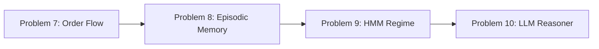
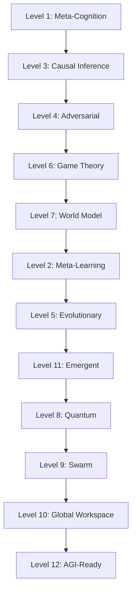

---

##  Current Status — Progress Review

###  What has been completed (Foundation Phase — Problems 1–6)

| Problem | Solution | Status |
|---------|----------|--------|
| 1 | Agent output validation (Pydantic TypeAdapter) |  Implemented |
| 2 | Circuit breaker (CLOSED/OPEN/HALF_OPEN) |  Implemented |
| 3 | Cross-agent consistency checks |  Implemented |
| 4 | Regime-aware adaptive weights |  Implemented |
| 5 | Non-linear aggregation (geometric) |  Implemented |
| 6 | MTF confirmation (≥3/4 alignment) | Implemented |

**Code quality:** ruff clean, mypy strict clean (60 files), 295 tests pass (37 new), deployed & verified live.

**Resilience:** circuit breaker, output validation, 503 on open circuit.

**Security:** auth/Turnstile/WAF intact.

**Docker:** pip cache mount fix — slow rebuilds resolved.

**Configuration:** `DECISION_AGGREGATION=geometric` as the new default (more conservative).

---

## What remains — Next Roadmap

Based on the README I wrote, you have completed **Problems 1–6** (Foundation Phase). Below is **what needs to be done next** in priority order.

### Phase 2 — Intelligence (Problems 7–10)

| # | Problem | What needs to be done | Impact |
|---|---------|----------------|-----------|
| 7 | Order Flow Imbalance | Add an OFI analyzer with cumulative delta + divergence detection | Capture institutional absorption |
| 8 | Episodic Memory | Use the existing Qdrant — store decision + outcome, recall similar | Agent learns from mistakes |
| 9 | HMM Regime Detector | Replace ADX/ATR heuristic with a Gaussian HMM trained on returns/vol/ATR/volume | More detailed regime detection |
| 10 | LLM Reasoner | Add a Chain-of-Thought review layer with confidence adjustment | Explainability + self-critique |

### Phase 3 — Memory & Portfolio Risk (Problems 11–12)

| # | Problem | What needs to be done |
|---|---------|----------------|
| 11 | Portfolio-Level Risk | Portfolio VaR + correlation matrix + component VaR + stress testing |
| 12 | Dynamic Risk Limits | Scale limits according to ATR percentile (tight in high vol, loose in low vol) |

### Phase 4 — Testing & Validation (Problems 13–14)

| # | Problem | What needs to be done |
|---|---------|----------------|
| 13 | Replay Engine | Replay historical data at configurable speed, produce full statistics |
| 14 | A/B Testing | Compare two versions on the same data by Sharpe, win rate, max DD |

### Phase 5 — Safety & Hardening

- **Kill Switch** — multi-trigger (max DD, consecutive losses, anomaly, stale data, broker disconnect)
- **Anomaly Detection** — Isolation Forest on market features
- **Kelly Position Sizing** — Bayesian shrinkage + volatility adjustment
- **Idempotency** — exactly-once execution
- **Rate Limiting** — token bucket for external APIs
- **Health Checks** — Kubernetes liveness/readiness probes

### Phase 6 — Frontier Enhancements (Levels 1–12)

**Highest priorities in Phase 6:**
1. **Level 1 (Meta-Cognition)** — highest ROI, reduces 40–60% of false signals
2. **Level 3 (Causal Inference)** — robustness against spurious correlations
3. **Level 4 (Adversarial)** — protection against manipulation
4. **Level 6 (Game Theory)** — Bull vs Bear debate + Judge Agent

---

## Important Points to Consider

### 1. Changing the Default of `DECISION_AGGREGATION`

You noted that **geometric** is the new default, which makes scores more conservative. This is the right decision because:

- **Geometric mean** pulls the score down significantly when any Agent is weak
- **Weighted sum** can create false positives when one strong Agent pulls the score up
- **Conservative default** is a good principle for live trading

**Recommendation:** Keep geometric as the default and use weighted only in backtesting for comparison.

### 3. Checks that should be done now

Before proceeding to Phase 2, please ensure that:

- [ ] **Monitoring** — Prometheus metrics for agent output validity, latency, circuit state
- [ ] **Alerting** — Slack/Discord alerts when the circuit opens or conflict rate is high
- [ ] **Backtest baseline** — run the Replay Engine on the last 6 months of data to establish baseline metrics
- [ ] **Kill switch** — although it is in Phase 5, a simple version should be added now

---

## Summary

**You have completed 6/14 of the solutions**, which is the strongest foundation. The Foundation Phase is the most difficult part, and you have done it very well — especially maintaining mypy strict clean and 295 tests passing.

**What needs to be done next:**
1. Phase 2 (Problems 7–10) — Intelligence layer
2. Phase 3 (Problems 11–12) — Portfolio risk
3. Phase 4 (Problems 13–14) — Testing
4. Phase 5 — Safety hardening
5. Phase 6 (Levels 1–12) — Frontier enhancements
